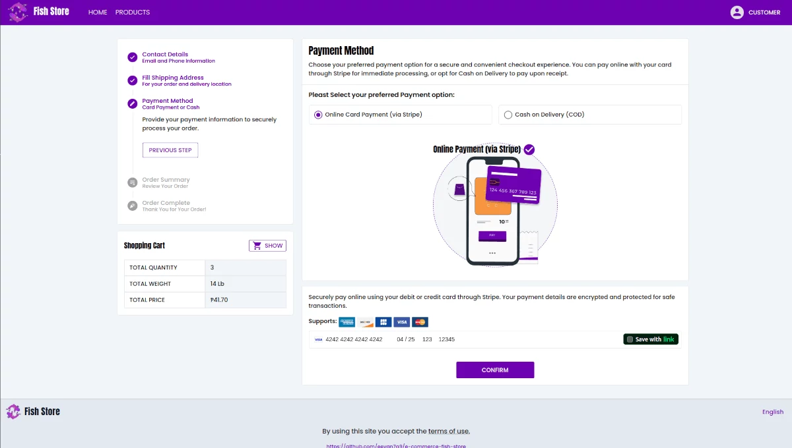

# Single-Vendor E-Commerce Fish Store

This project is a single-vendor e-commerce platform designed for selling fish and seafood products. The application is built with a Laravel API backend and a Quasar Vue.js frontend, using TypeScript for type safety and Pinia for state management.

With flexible architecture that separates frontend and backend services, making it suitable for future enhancements and third-party integrations.

| Admin Products | Checkout | 
|---------|---------|
|  |  | 

## Tech Stack
- **Frontend**: [Quasar (Vue 3)](https://quasar.dev/)
- **Backend**: [Laravel 11+](https://laravel.com/)
- **Language**: Typescript 5.7+, Javascript & PHP 8.2 
- **Database**: Mysql, Postgress.

## Technologies & Tools
- Web SPA & Android/IOS - [Vite](https://vite.dev/) & [Capacitor](https://capacitorjs.com/)
- State Management [Pinia](https://pinia.vuejs.org/)
- internationalization [i18next](https://www.i18next.com/)
- CSS framework [TailwindCss](https://tailwindcss.com/)
- Card Payment [Stripe API](https://docs.stripe.com/)
- Charts [Google Charts](https://developers.google.com/chart) 
- Icons [MDI](https://pictogrammers.com/library/mdi/) & [Google Icons](https://fonts.google.com/icons)
- Illustrations [Freepik](https://www.freepik.com/) & [Undraw](https://undraw.co/)
- Animation [GSAP](https://gsap.com/)

## Configure Frontend:
navigate to **frontend-fish-store/** open terminal and 

- install [Quasar CLI](https://quasar.dev/start/quasar-cli)

- install dependencies run `npm install`

#### Setup Frontend Environment

  1. Create `.env` use `.env.example` as reference.

  2. Set server api url on `.env`.

          SERVER_API_URL='http://localhost:8000/api'

  3. Add stripe publish_key on `.env`

          STRIPE_PK="publish-key"

#### Initialize Frontend

- run to serve

  `quasar dev`

- the default URL would be http://localhost:8888/
  

## Configure Backend:
navigate to **backend-fish-store/** open terminal and 
- install requirements:
  
  1. [PHP 8.3+](https://www.php.net/manual/en/install.php) 
  2. [Composer](https://getcomposer.org/) 
  3. [Mysql Server](https://www.mysql.com/downloads/)


#### Setup Backend Environment

  1. Create `.env` use `.env.example` as reference.

  2. Add Database and Stripe Keys.

      ```
      DB_CONNECTION=mysql
      DB_HOST=127.0.0.1
      DB_PORT=3306
      DB_DATABASE=database_name
      DB_USERNAME=root
      DB_PASSWORD=database_password
      ```

      Add Stripe [STRIPE SECRET](https://dashboard.stripe.com/apikeys)

      ```
      STRIPE_SECRET='secret_key'
      ```
  3. Add Initial Admin Credentials (Update the Password after):
      ```
      SEEDER_ADMIN_EMAIL=admin@email.com
      SEEDER_ADMIN_PASSWORD=password
      ```
#### Install Dependencies
open terminal and run

- install dependencies:

  `composer install`

- add database migrations

  `php artisan migrate`

- generate key

  `php artisan key:generate`

#### Seed Admin
  - Run to seed Admin `php artisan db:seed --class=AdminSeeder`

#### Initialize backend

`php artisan serve`

#### Add Dummy Data (Optional):

- Add database dummies

  `php artisan db:seed`